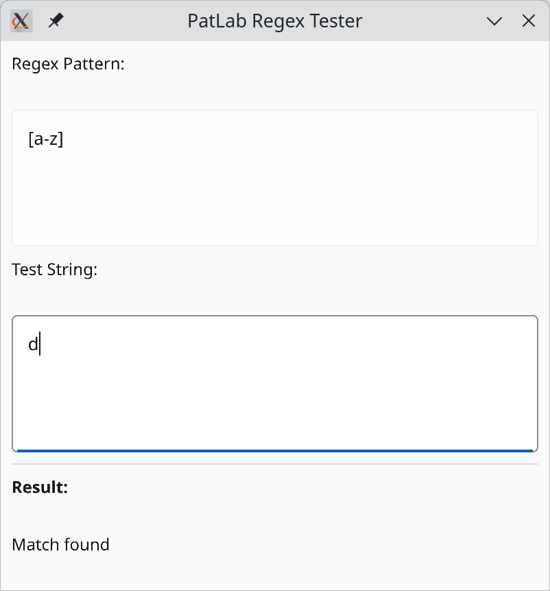

# PatLab

This is a simple proof of concept app that allows you to test regular expressions.

It was created as a test for [Copilot chat agent mode](https://code.visualstudio.com/docs/copilot/chat/chat-agent-mode). Briefly, it was able to set up a Rust project, but it wasn't able to turn it into a working prototype without manual intervention. It also weirdly doubled up the files and directory structure. It occasionally managed to get fairly close to finding something that might work by actually trying to look at documentation, but it wasn't able to derive relevant knowledge from it. But I didn't do much to steer it other than copy pasting a sample app from actually relevant documentation, and directing a few minor tweaks after it finally managed to create something that would build.
